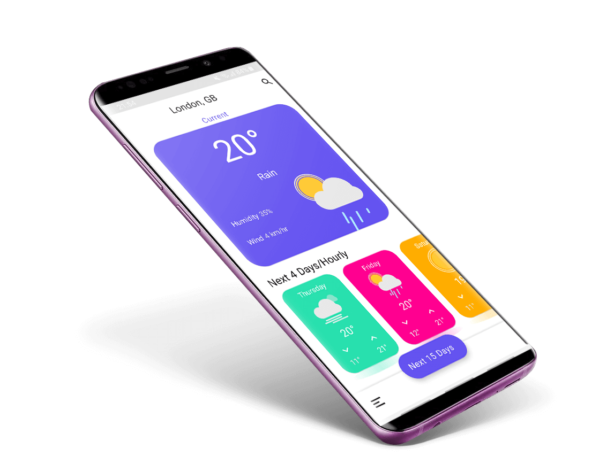

# Weather app

**Requirements**
- Android Studio 4.0.0
- JDK 8
- Android SDK 29
- Supports API Level +21
- Material Components 1.3.0-alpha01

**Highlights**
- Use [OpenWeatherMap] API
- Use Material Design 2
- Dark Mode
- Support two language. English & Persian
- Use locale Database

**Demo** application is available in [Release]

**Libraries & Dependencies**
- [Support libraries]: appcompat / recyclerview / constraintlayout
- [Material Design 2]: MaterialCardView / MaterialButton / Bottom App Bars / ExtendedFloatingActionButton
- [FastAdapter]: The bullet proof, fast and easy to use adapter library, which minimizes developing time to a fraction
- [Calligraphy3]: Custom fonts in Android the easy way
- Square [Retrofit] / [Okhttp] / [Logging-Interceptor]
- [ObjextBox]: ObjectBox is a superfast lightweight database for objects
- [RxAndroid] Reactive Extensions for Android
- [Glide]: An image loading and caching library for Android focused on smooth scrolling
- [Lottie-Android]: Render After Effects animations natively on Android
- [MaterialSearchView]: Cute library to implement SearchView in a Material Design Approach
- [MPAndroidChart]: A powerful & easy to use chart library for Android
- [Firebase Core] / Crashlytics

**Credit**

### This app inspired from [Weather App Freebie] concept Designed by [Raman Yv] 
